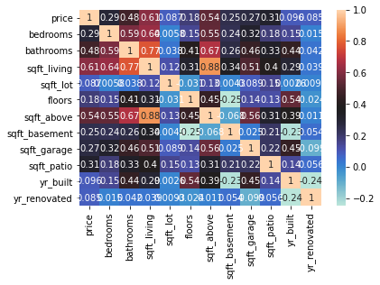
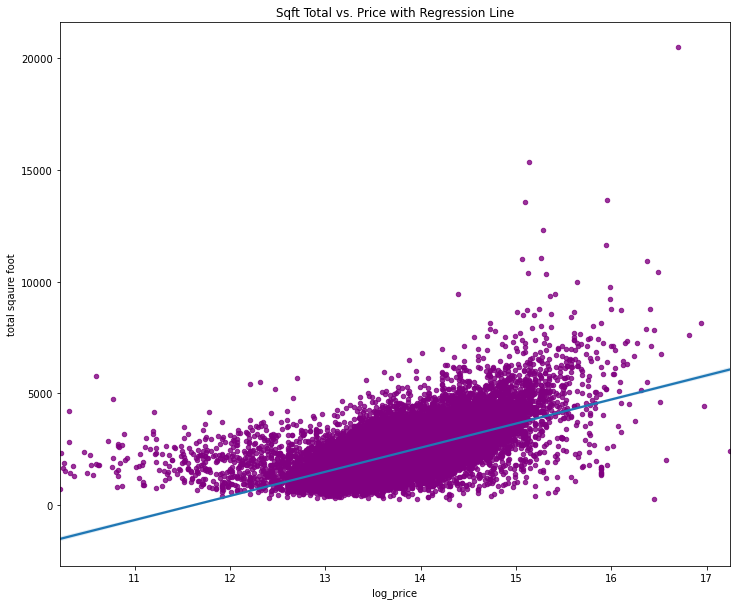
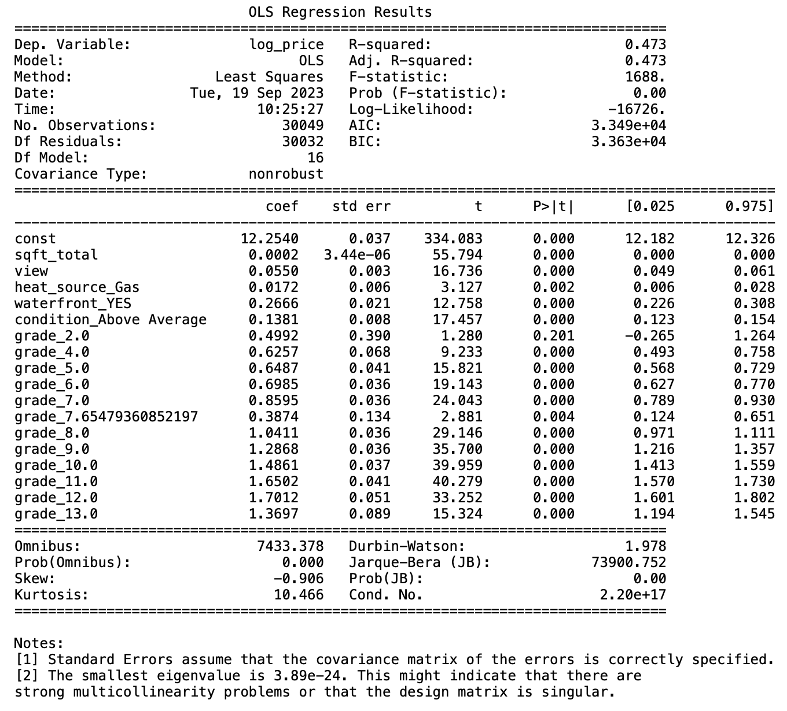

# KC Home Analysis
Nancy Lopez


## Introduction
This project data analysis will help identify what features in homes help increase the sale price of the home. The project includeds data cleaning, data exploratory, and model improvement. All leading to a final reccomendation based on the final model for our stockholders.

## Business Problem
The real estate investment company's primary goal is to maximize the sale prices of properties in King County. To achieve this, we aim to provide a predictive model that helps the company make informed decisions on property selling. Our analysis will focus on identifying key property features that significantly impact sale prices, enabling the company to set optimal pricing strategies. Such as property size, waterfront listings, view quality, heating source, condition, and grade.

## Data
Data used for this analysis is from the King County House Sales dataset is a dataset that contains information about real estate transactions in King County, Washington. It includes a variety of features or columns, such as property characteristics (square footage, number of bedrooms and bathrooms), house condition, grade, view, and information about the sale price.

## Data Cleaning and Exploration 
Data preparation and exploration are fundamental steps in any data analysis or machine learning project. This phase involves getting the raw data ready for analysis, understanding its structure, and gaining insights before building models or drawing conclusions.

- In our data exploration phase, we delved into the dataset to uncover insights. Here's what we found:

### Visualizations

**Correlation Heatmap**


*We find that features like 'sqft_living' and 'grade' have strong positive correlations with home prices.*

**Sqft Total vs. Price with Regression Line**
choosen basline model


*As price increases, homes generally tend to have larger total square footages. The regression line represents this positive relationship, helping us understand how these two factors are connected.*

### Final Regression Model

**Final Model**



### Model Performance and Key Features

Our predictive model, Model 4, demonstrates strong performance in estimating home prices within King County. R-squared value of approximately 0.473, it explains nearly 47% of the variance in home prices. Additionally indicating the reliability of the model's explanatory power. The F-statistic of 1688 further confirms the overall statistical significance of the model.

#### Key Findings
Key features that significantly impact home prices include:

1. **Square Footage**: Each additional square foot in property size increases the estimated sale price by approximately $200 or every 1000 sft for $200,000.

2. **View Quality**: Improving view quality adds roughly $55,000 to the estimated sale price.

3. **Heat Source**: Gas heating sources contribute an estimated increase of approximately $17,000 in sale price.

4. **Waterfront Properties**: These have an estimated premium of approximately $267,000 compared to non-waterfront properties.

5. **Condition Above Average**: Homes in above-average condition sell for approximately $138,000 more.

6. **Grade Categories**:  Higher-grade properties sell for substantially more, with grade 13.0 properties having an estimated price increase of approximately $1,369,000.

## Conclusion
Recommendations for the real estate investment company:

1. **Prioritize Waterfront Properties:** If you're in the market for a dreamy waterfront property, go for it! Our analysis shows they tend to be worth the investment.

2. **View:** A beautiful view can make all the difference. When searching for homes, consider properties with superior views—they can be more valuable in the long run.

3. **Consider Heat Source:** The choice of heating source matters. Homes with a gas heating source have a positive impact on price of the home.

4. **Look for Above-Average Condition Homes:** Well-kept properties not only make for comfortable living but also hold their value. Consider properties with above-average conditions or those you can improve to meet this standard.

5. **Size Matters:** Square footage plays a big role in pricing. Think about going for a larger home; even a little extra space can increase the estimated price.

6. **Grades:** Higher-grade properties often come with higher prices. They're worth considering for their potential to yield better returns.


**Pricing Strategy:** Consider square footage, view quality, condition, waterfront locations, superior views, and heat source when pricing homes to optimize returns.


## Next Steps

- **Data Enrichment**: Continue to collect and incorporate relevant data to enhance the model's predictive accuracy. This may include additional property features, economic indicators, and market dynamics.


Please view full analysis in [Jupyter Notebook](https://github.com/nv593/KC_Home_Analysis/blob/main/student.ipynb) or [Presentation](https://github.com/nv593/KC_Home_Analysis/blob/main/KC%20home%20analysis.pdf)

### Repository Structure

```
├── Visulizations
├── Data
├── KC_Home_Analysis.pdf
├── README.md
├── kc_analysis.ipynb
