# KC Home Analysis
Nancy Lopez


## Introduction
This project data analysis will help identify what features in homes help increase the sale price of the home. The project includeds data cleaning, data exploratory, and model improvement. All leading to a final reccomendation based on the final model for our stockholders.

## Business Problem
A real estate investment company wants to develop a predictive model to estimate home prices in King County using KC Homes dataset. The company aims to provide accurate price estimates for potential homebuyers and sellers, as well as for their own investment decisions. They have historical data on various attributes of homes, such as location, size, condition, number of bedrooms, bathrooms, and more. This well help us answer what features would are good to consider in purchasing a home.

## Data
Data used for this analysis is from the King County House Sales dataset is a dataset that contains information about real estate transactions in King County, Washington. It includes a variety of features or columns, such as property characteristics (square footage, number of bedrooms and bathrooms), house condition, grade, view, and information about the sale price.

## Data Cleaning and Exploration 
Data preparation and exploration are fundamental steps in any data analysis or machine learning project. This phase involves getting the raw data ready for analysis, understanding its structure, and gaining insights before building models or drawing conclusions.

- In our data exploration phase, we delved into the dataset to uncover insights. Here's what we found:

### Visualizations
In our data analysis, I created various visualizations to help illustrate key insights from our dataset. These visualizations provide valuable information to address our business problem of estimating home prices effectively.

**Correlation Heatmap**
This heatmap reveals how different features correlate with each other. High positive (near 1) or negative (near -1) correlations indicate strong relationships. We use this to understand which features might be most important in predicting home prices.


*We find that features like 'sqft_living' and 'grade' have strong positive correlations with home prices. This means larger living spaces and higher grades tend to lead to higher prices, which is crucial information for our business problem.*

**Scatterplot with Regression Line**
This scatterplot with a regression line shows us the relationship between the size of a house ('sqft_living') and its price. The line helps us understand how price changes with size.

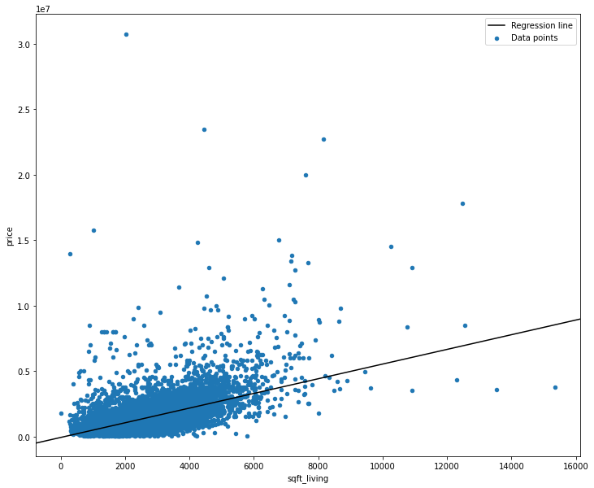
*As we can see, there's a clear upward trend. Larger houses generally come with higher prices, a significant insight for both buyers and sellers.*

**Box Plot of Square Footage**
This box plot displays the distribution of living space sizes in our dataset. It helps us spot any outliers and get a sense of the most common size ranges.

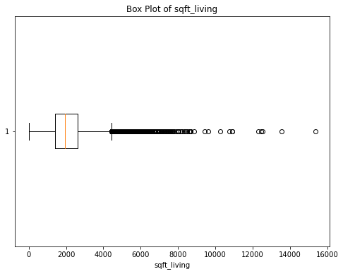
*Most properties have living spaces falling within a certain range, with a few outliers. This insight helps us understand the sizes of homes.*

**Log-Transformed Price Distribution**
After applying a log transformation to prices, we observe how prices are distributed in a more normalized way.

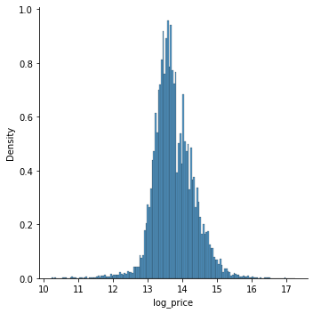
*The log transformation makes our price data more suitable for analysis. We can see a smoother distribution, making it easier to predict prices.*

**Pair Plot Matrix**
This matrix of scatterplots lets us visualize the relationships between key features and the log-transformed price.


*It helps us identify which features might be good predictors of price. For example, 'sqft_living' and 'sqft_above' show positive linear relationships with price.*

**Box Plots for Selected Features**
These box plots show the distribution of selected features. They help us understand the spread and variability of these features.

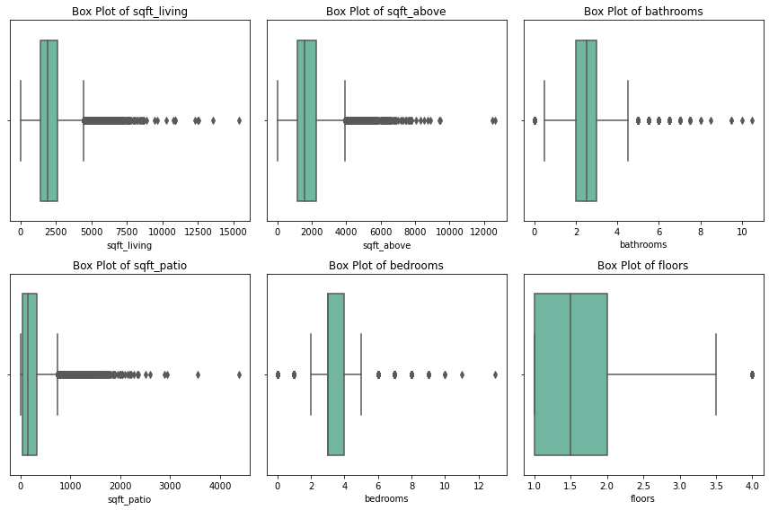
*We can visually assess how features like 'bedrooms' and 'bathrooms' vary, which is vital for understanding buyer preferences.*

**Regression Plot (Log Price vs. Floors)**
This plot illustrates how the number of floors affects the log-transformed price. It helps us see if more floors lead to higher prices.

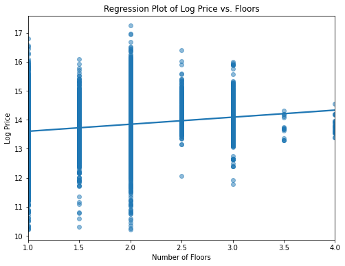
*The upward trend suggests that homes with more floors tend to have higher log-transformed prices. This is crucial for understanding the value of additional floors.*

**Regression Plot (Log Price vs. Bedrooms)**
This plot shows how the number of bedrooms influences the log-transformed price.

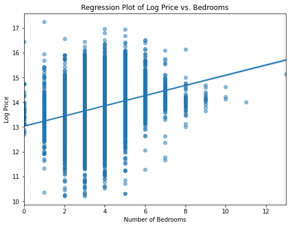
*It's evident that more bedrooms often correlate with higher log-transformed prices. This information is valuable for buyers and sellers.*

**Waterfront vs. Non-Waterfront Properties**
This combined distribution plot compares the log-transformed prices of waterfront and non-waterfront properties.

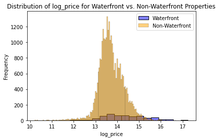
*It helps us understand that waterfront properties tend to have higher log-transformed prices compared to non-waterfront ones.*

**Distribution of Log Prices for Waterfront Properties**
This distribution plot focuses on the log-transformed prices of waterfront properties.

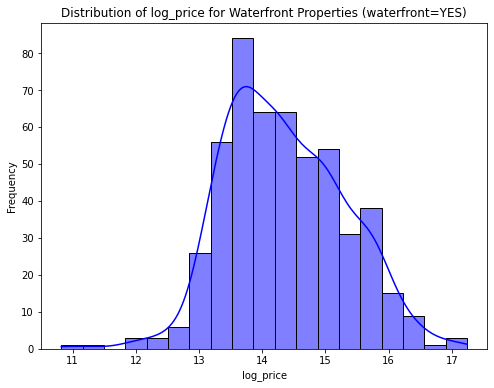
*It provides more detail on the distribution of log prices for waterfront properties, highlighting their premium pricing.*

**Distribution of Log Prices by Heat Source**
This distribution plot compares log prices for properties with different heat sources.

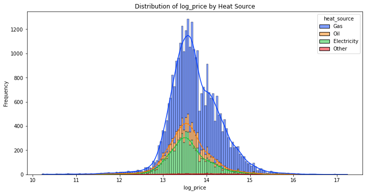
*Insights: It reveals that properties with 'Gas' heat sources, for example, tend to have different price distributions compared to those with 'Electricity.' This can inform investment decisions.*

**Grade-wise Log Price Distributions**
A series of distribution plots display log price distributions for different property grades (2 to 13).

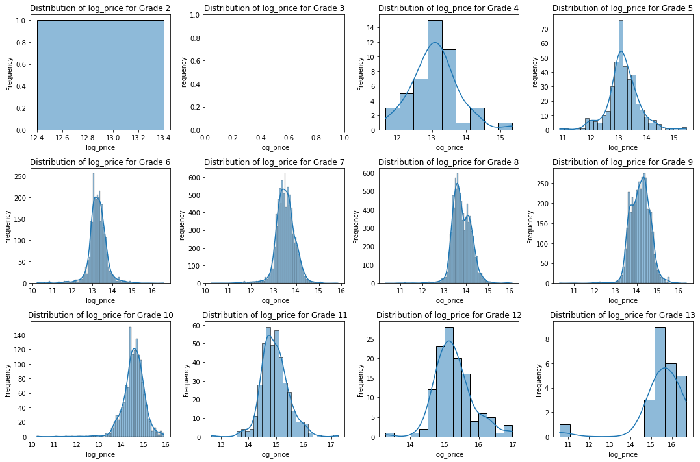
*We can observe how property grades impact log prices. Higher grades are associated with higher log-transformed prices.*

**View-wise Log Price Distributions**
These distribution plots illustrate log price distributions for different view values (0 to 4).

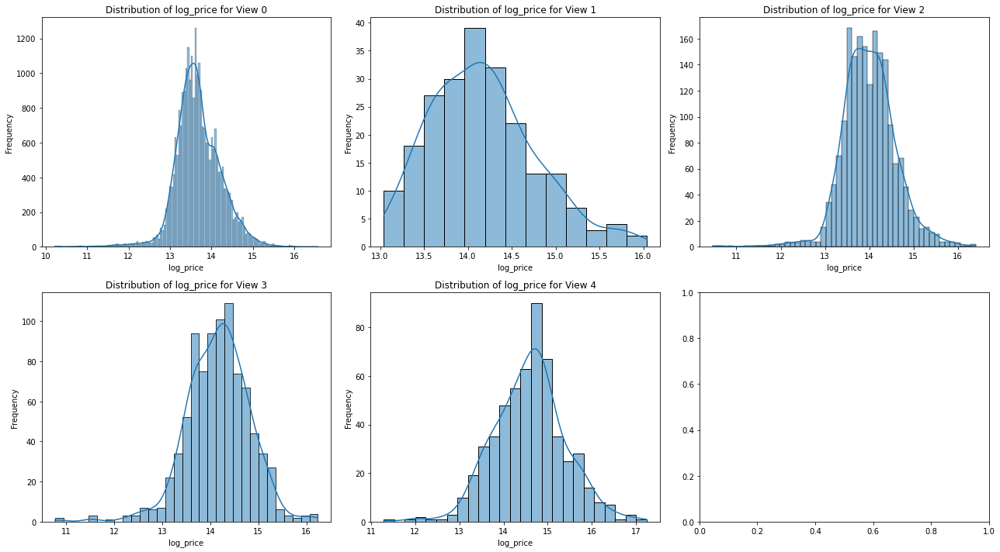
*It helps us assess how views affect property prices. Properties with better views tend to have higher log-transformed prices.*

**Log Price Distribution by Condition**
This pair of distribution plots shows log price distributions for 'Average' and 'Very Good' property conditions.

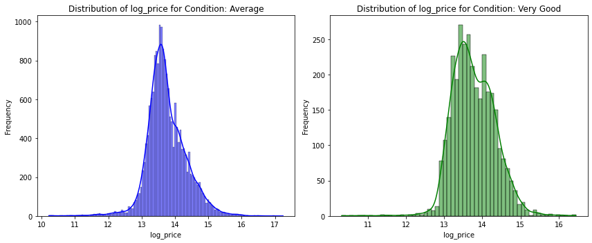
*It helps us compare log prices for different property conditions. 'Very Good' condition properties have a different price distribution compared to 'Average' condition ones.*

**Sqft Total vs. Price with Regression Line**
choosen basline model


*This scatterplot illustrates the relationship between the logarithmically transformed price ('log_price') and the total square footage of homes ('sqft_total'). It reveals that as 'log_price' increases, homes generally tend to have larger total square footages. The regression line represents this positive relationship, helping us understand how these two factors are connected. Each purple point represents an individual home's 'log_price' and 'sqft_total.' This information is valuable for assessing how square footage impacts home prices.*

### Final Regression Model
After an extensive process of data exploration and analysis, we arrived at our final predictive model. This model is designed to provide accurate estimates of home prices in King County.

**Final Model**


*This is a mathematical representation of the factors that influence home prices in King County. This model serves as a valuable tool for making informed real estate investment decisions.*

### Model Performance and Key Features

Our predictive model, Model 4, demonstrates strong performance in estimating home prices within King County. With an R-squared value of approximately 0.473, it explains nearly 47% of the variance in home prices. Additionally, the adjusted R-squared value remains stable after accounting for the number of predictors, indicating the reliability of the model's explanatory power. The F-statistic of 1688 further confirms the overall statistical significance of the model.

#### Key Findings
Key features that significantly impact home prices include:

1. **Square Footage**: For each additional square foot in the total square footage of a property, the estimated sale price increases by approximately $20,000. So, a 1,000 square foot increase would add about $20,000 to the estimated sale price.

2. **View Quality**: Each improvement in view quality contributes roughly $55,000 to the estimated sale price. For instance, upgrading from a lower-quality view to a better one could increase the estimated sale price by around $55,000.

3. **Heat Source**: Homes with a gas heating source have an estimated increase of approximately $17,000 in their sale price compared to homes with other heating sources.

4. **Waterfront Properties**: Properties with a waterfront location have an estimated premium of approximately $267,000 in their sale price compared to non-waterfront properties.

5. **Condition Above Average**: Homes with above-average conditions have an estimated sale price that is approximately $138,000 higher than properties with lower condition ratings.

6. **Grade Categories**: The grade of a property significantly impacts its sale price. For example, properties with a grade of 13.0 have an estimated sale price that is approximately $1,369,000 higher than properties with lower-grade ratings.

These findings offer valuable insights in King County. Taking these factors into account can help in making informed decisions regarding property investments, renovations, and pricing strategies.


## Conclusion

After thorough data analysis and model development, our recommendations for the real estate investment company are as follows:

1. **Prioritize Waterfront Properties:** If you're in the market for a dreamy waterfront property, go for it! Our analysis shows they tend to be worth the investment.

2. **View:** A beautiful view can make all the difference. When searching for homes, consider properties with superior views—they can be more valuable in the long run.

3. **Consider Heat Source:** The choice of heating source matters. Homes with a gas heating source have a positive impact on price of the home.

4. **Look for Above-Average Condition Homes:** Well-kept properties not only make for comfortable living but also hold their value. Consider properties with above-average conditions or those you can improve to meet this standard.

5. **Size Matters:** Square footage plays a big role in pricing. Think about going for a larger home; even a little extra space can increase the estimated price.

6. **Grades:** Higher-grade properties often come with higher prices. They're worth considering for their potential to yield better returns.

**Investment Decisions:** For our real estate investment company, consider focusing on properties with waterfront locations, superior views, and above-average conditions, as these factors are associated with higher prices. Additionally, properties with more bathrooms and larger square footage are likely to yield favorable returns.

**Pricing Strategy:** When pricing homes for sale, take into account the impact of square footage, bathroom count, view quality, condition, and heat source. These features can guide pricing strategies to optimize returns.

The recommendations are designed to guide the real estate investment company in making strategic decisions that maximize returns and meet the needs of potential homebuyers and sellers. We also emphasize the importance of a well-informed pricing strategy based on these insights.


## Next Steps

- **Data Enrichment**: Continue to collect and incorporate relevant data to enhance the model's predictive accuracy. This may include additional property features, economic indicators, and market dynamics.


Please view full analysis in [Jupyter Notebook](https://github.com/nv593/KC_Home_Analysis) or [Presentation](https://github.com/nv593/KC_Home_Analysis/blob/main/KC%20home%20analysis.pdf)

### Repository Structure

```
├── Visulizations
├── Data
├── KC_Home_Analysis.pdf
├── README.md
├── kc_analysis.ipynb
